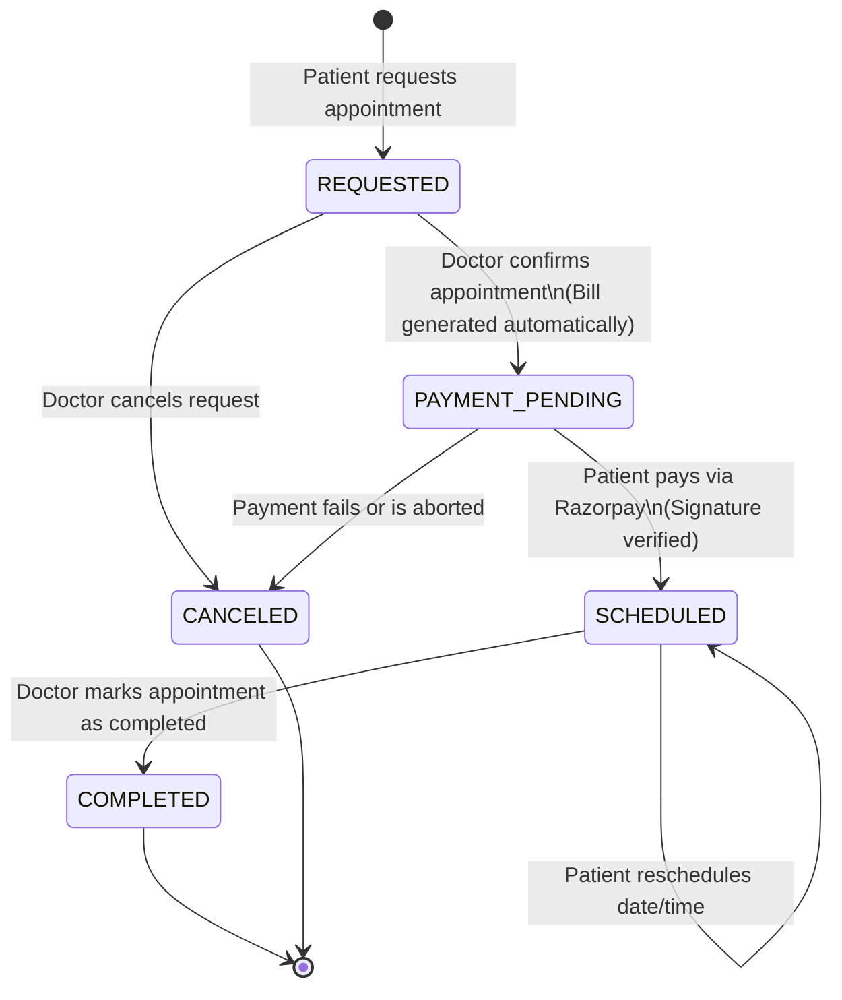
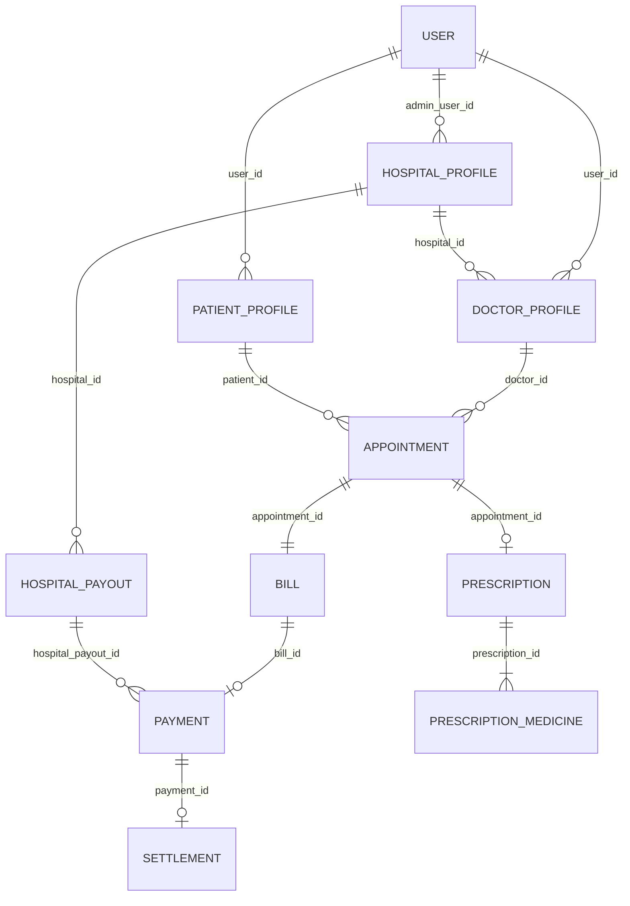

# 🏥 MediCore - Hospital Management & Healthcare Payment Platform

[](https://openjdk.org/)
[](https://spring.io/projects/spring-boot)
[](https://spring.io/projects/spring-security)
[](https://www.mysql.com/)
[](https://razorpay.com/)
[](http://localhost:8070/swagger-ui/index.html)
[](#)

**MediCore** is an enterprise-grade, multi-tenant healthcare management and medical billing platform built with **Spring Boot 3** and **Java 21**. It connects patients, doctors, hospitals, and platform administrators within a secure, role-based ecosystem featuring automated appointment scheduling, digital prescriptions, integrated payment processing via **Razorpay**, and an automated multi-tier revenue-sharing model.

---

## 📑 Table of Contents

- [Key Features](#-key-features)
- [Architecture & Tech Stack](#-architecture--tech-stack)
- [System Roles & Access Control](#-system-roles--access-control)
- [Appointment & Billing Lifecycle](#-appointment--billing-lifecycle)
- [Revenue Sharing Model](#-revenue-sharing-model)
- [Database Schema & Domain Model](#-database-schema--domain-model)
- [API Reference](#-api-reference)
  - [Authentication & Public APIs](#1-authentication--public-apis-public)
  - [Patient APIs](#2-patient-apis-patient)
  - [Doctor APIs](#3-doctor-apis-doctor)
  - [Hospital APIs](#4-hospital-apis-hospital)
  - [Admin APIs](#5-admin-apis-admin)
  - [Prescription APIs](#6-prescription-apis-prescription)
- [Standard API Response Format](#-standard-api-response-format)
- [Prerequisites & Setup](#-prerequisites--setup)
- [Configuration](#-configuration)
- [Running the Application](#-running-the-application)
- [Testing](#-testing)

---

## 🌟 Key Features

### 👥 Multi-Role Role-Based Access Control (RBAC)
- Fine-grained security separating **Admin**, **Hospital**, **Doctor**, and **Patient**.
- Stateless authentication powered by **JSON Web Tokens (JWT)** with HMAC-SHA256 signing.

### 🏥 Hospital Administration
- Onboarding and profile management for medical institutions.
- Doctor affiliation requests and approval/rejection workflows (`WAITING_FOR_APPROVAL`, `APPROVED`, `REJECTED`).
- Institutional analytics: doctor count, total appointments, monthly visit volumes, and gross monthly revenue.

### 🩺 Doctor Workspace
- Doctor profile creation with specialization, qualifications, experience, and consultation fees.
- Real-time appointment management: accept (`CONFIRMED`), reject (`CANCELED`), and complete (`COMPLETED`) consultations.
- Digital prescription generation with structured medication schedules (drug name, dosage, frequency, follow-up dates).
- Monthly earnings and receivable tracking dashboards.

### 🧑‍💼 Patient Care & Booking
- Profile management (demographics, blood group, medical history address).
- Doctor & hospital directory discovery without authentication requirements.
- Appointment booking with reason for visit and reschedule capability.
- Instant digital bill view and secure payment gateway checkout.

### 💳 Integrated Payments & Financial Analytics
- Direct integration with **Razorpay** SDK for server-side order generation.
- Cryptographic webhook/callback signature verification using HMAC-SHA256.
- Automatic bill generation upon doctor appointment confirmation.
- Transparent multi-party revenue split between Platform, Hospital, and Doctor.
- Aggregated financial dashboards tailored per role.

---

## 🛠 Architecture & Tech Stack

| Layer / Concern | Technology / Library | Version / Details |
| :--- | :--- | :--- |
| **Language** | Java | 21 (LTS) |
| **Framework** | Spring Boot | 3.5.5 |
| **Security** | Spring Security + JJWT | 0.12.6 (Stateless JWT Auth) |
| **Data Access** | Spring Data JPA / Hibernate | ORM with MySQL Dialect |
| **Database** | MySQL Server | 8.0+ |
| **Payment Gateway**| Razorpay Java SDK | 1.4.9 |
| **API Documentation**| Springdoc OpenAPI (Swagger UI) | 2.8.9 |
| **Code Generation**| Project Lombok | Boilerplate elimination |
| **Build Tool** | Apache Maven | Wrapper included (`./mvnw`) |
| **Testing** | JUnit 5 & TestNG | 7.12.0 |

---

## 🔐 System Roles & Access Control

| Role | Prefix | Permissions / Scope |
| :--- | :--- | :--- |
| `ROLE_ADMIN` | `/admin/**` | Global platform administration, hospital onboarding, platform revenue metrics. |
| `ROLE_HOSPITAL` | `/hospital/**` | Manage hospital profile, approve/reject doctor affiliations, view hospital revenue and doctor earnings. |
| `ROLE_DOCTOR` | `/doctor/**` | Manage doctor profile, review appointment requests, issue prescriptions, track earnings. |
| `ROLE_PATIENT` | `/patient/**` | Manage patient profile, request & reschedule appointments, view bills, complete payments. |
| **Public** | `/public/**`, `/prescription/**` | User registration & login, doctor search, hospital directory, prescription retrieval, Swagger UI. |

---

## 🔄 Appointment & Billing Lifecycle



### Flow Breakdown:
1. **Request**: Patient submits an appointment request (`POST /patient/appointments/request`). State is set to `REQUESTED`.
2. **Review**: The doctor inspects the request (`GET /doctor/appointments`).
3. **Confirmation & Invoicing**:
   - If doctor confirms (`PUT /doctor/appointments/{id}/CONFIRMED`), appointment transitions to `PAYMENT_PENDING`.
   - A `Bill` entity is automatically instantiated with status `PENDING` based on doctor's consultation fee.
4. **Checkout**: Patient initiates payment (`POST /patient/payment/create-order/{billId}`). A Razorpay order is registered.
5. **Verification & Revenue Split**:
   - Frontend passes `razorpay_order_id`, `razorpay_payment_id`, and `razorpay_signature` to `POST /patient/payment/verify`.
   - The backend validates the cryptographic signature.
   - On success: Bill becomes `PAID`, Appointment moves to `SCHEDULED`, and revenue shares are calculated and persisted.
6. **Consultation & Completion**: Doctor conducts consultation, uploads prescription (`POST /doctor/prescription`), and marks appointment as `COMPLETED`.

---

## 💰 Revenue Sharing Model

Whenever an appointment bill is settled, MediCore splits the total fee in paise into three distinct shares:

```
                      Total Consultation Fee (100%)
                                   │
         ┌─────────────────────────┴─────────────────────────┐
         ▼                                                   ▼
Platform Share (10%)                              Remaining Balance (90%)
                                                             │
                                   ┌─────────────────────────┴─────────────────────────┐
                                   ▼                                                   ▼
                         Hospital Share (20% of net)                         Doctor Share (Remainder)
                              = 18% of total                                      = 72% of total
```

- **Platform Commission**: `10%` of gross payment.
- **Hospital Affiliation Fee**: `20%` of remaining balance after platform fee (`18%` effective gross).
- **Doctor Net Payout**: Remainder `80%` of remaining balance (`72%` effective gross).

---

## 🗄 Database Schema & Domain Model



### Core Entities:
- **`User`**: Authentication principal (email, password hash, role: `ADMIN`, `HOSPITAL`, `DOCTOR`, `PATIENT`).
- **`HospitalProfile`**: Hospital details, address, licensing, verification status, linked administrator.
- **`DoctorProfile`**: Specialization, experience, qualifications, fees, hospital association, approval state.
- **`PatientProfile`**: Demographic info, date of birth, blood group, contact address.
- **`Appointment`**: Scheduled time, status (`REQUESTED`, `CONFIRMED`, `PAYMENT_PENDING`, `SCHEDULED`, `COMPLETED`, `CANCELED`), reason, consultation amount in paise.
- **`Bill`**: Invoicing record linked to appointment, patient, doctor, hospital; status (`PENDING`, `PAID`).
- **`Payment`**: Razorpay gateway transaction tracking (`orderId`, `paymentId`, fee splits, status: `CREATED`, `SUCCESS`, `FAILED`).
- **`Prescription` & `PrescriptionMedicine`**: Clinical diagnosis notes, follow-up dates, medicine names, dosages, durations.
- **`HospitalPayout` & `Settlement`**: Batching payouts and tracking platform-to-institution disbursement.

---

## 📡 API Reference

### 1. Authentication & Public APIs (`/public`)

| Method | Endpoint | Description | Auth |
| :--- | :--- | :--- | :--- |
| `GET` | `/public/hello` | Health check and greeting endpoint | Open |
| `POST` | `/public/register` | Register a new account (`ROLE_PATIENT`, `ROLE_DOCTOR`, etc.) | Open |
| `POST` | `/public/login` | Authenticate user credentials and receive JWT | Open |
| `GET` | `/public/doctors` | List all verified doctor profiles | Open |
| `GET` | `/public/doctors/{id}` | Get doctor profile by ID | Open |
| `GET` | `/public/hospital/all` | List all registered hospitals | Open |
| `GET` | `/public/hospital/{id}` | Get hospital details by ID | Open |
| `GET` | `/public/hospital/{id}/doctors` | List all doctors affiliated with a hospital | Open |
| `GET` | `/public/bill/getByAppointmentId/{id}` | Retrieve bill associated with an appointment | Open |
| `GET` | `/public/bill/getByDoctor/{id}` | Retrieve all bills under a doctor | Open |

#### Request Body - Register (`POST /public/register`):
```json
{
  "fullName": "Jane Doe",
  "email": "jane.doe@example.com",
  "password": "Password123!",
  "role": "ROLE_PATIENT"
}
```

---

### 2. Patient APIs (`/patient`)
> *Requires `Authorization: Bearer <token>` with role `ROLE_PATIENT`*

| Method | Endpoint | Description |
| :--- | :--- | :--- |
| `POST` | `/patient/profile` | Create/complete patient profile details |
| `GET` | `/patient/profile` | Retrieve current patient's profile |
| `POST` | `/patient/appointments/request` | Request an appointment with a doctor |
| `GET` | `/patient/appointments` | List all appointments of the logged-in patient |
| `GET` | `/patient/appointments/{id}` | Retrieve specific appointment details |
| `PUT` | `/patient/appointments/reschedule` | Reschedule an existing appointment |
| `GET` | `/patient/bill` | List all billing records for the patient |
| `GET` | `/patient/bill/status/{status}` | Filter bills by status (`PENDING`, `PAID`) |
| `POST` | `/patient/payment/create-order/{billId}` | Initiate Razorpay order for an unpaid bill |
| `POST` | `/patient/payment/verify` | Verify Razorpay payment signature and complete booking |

#### Request Body - Book Appointment (`POST /patient/appointments/request`):
```json
{
  "doctorId": 2,
  "appointmentDateTime": "2026-09-10T10:30:00",
  "reason": "Routine cardiac checkup and BP review"
}
```

#### Request Body - Verify Payment (`POST /patient/payment/verify`):
```json
{
  "razorpay_order_id": "order_OG7iVnF8tP8wL1",
  "razorpay_payment_id": "pay_OG7j8HwP3K4m9s",
  "razorpay_signature": "e5c6a1b2..."
}
```

---

### 3. Doctor APIs (`/doctor`)
> *Requires `Authorization: Bearer <token>` with role `ROLE_DOCTOR`*

| Method | Endpoint | Description |
| :--- | :--- | :--- |
| `POST` | `/doctor/profile` | Setup doctor profile and select affiliated hospital |
| `GET` | `/doctor/profile` | View current doctor's profile and approval status |
| `GET` | `/doctor/appointments` | List all incoming and scheduled appointments |
| `GET` | `/doctor/appointments/{id}` | Get appointment details by ID |
| `PUT` | `/doctor/appointments/{id}/{status}` | Update status (`CONFIRMED`, `CANCELED`, `COMPLETED`) |
| `POST` | `/doctor/prescription` | Upload digital prescription with medicine schedule |
| `GET` | `/doctor/dashboard` | Monthly earnings, appointment volume, and payout status |

#### Request Body - Create Doctor Profile (`POST /doctor/profile`):
```json
{
  "hospitalId": 1,
  "about": "Cardiologist with 10+ years experience in interventional cardiology.",
  "gender": "Female",
  "specialization": "Cardiology",
  "qualification": "MBBS, MD (Cardiology)",
  "experienceYears": 12,
  "address": "Suite 404, MediCity Medical Enclave",
  "consultationFees": 1200,
  "phoneNumber": "+919876543210",
  "dateOfBirth": "1988-04-15"
}
```

#### Request Body - Upload Prescription (`POST /doctor/prescription`):
```json
{
  "appointmentId": 15,
  "followUpDate": "2026-09-24",
  "prescriptionMedicines": [
    {
      "medicineName": "Amlodipine",
      "dosage": "5mg",
      "frequency": "Once daily",
      "duration": "14 days",
      "instructions": "Take after breakfast"
    }
  ]
}
```

---

### 4. Hospital APIs (`/hospital`)
> *Requires `Authorization: Bearer <token>` with role `ROLE_HOSPITAL`*

| Method | Endpoint | Description |
| :--- | :--- | :--- |
| `POST` | `/hospital/details` | Create or update hospital facility profile |
| `GET` | `/hospital/details` | Retrieve current hospital details |
| `GET` | `/hospital/dashboard/stats` | High-level metrics (total doctors, appointments, revenue) |
| `GET` | `/hospital/dashboard` | Doctor-by-doctor monthly earnings and share breakdown |
| `GET` | `/hospital/doctors` | List all doctors affiliated with this hospital |
| `GET` | `/hospital/doctors/pending` | List pending doctor affiliation applications |
| `PUT` | `/hospital/doctors/{doctorId}/approve` | Approve doctor profile for clinical practice |
| `PUT` | `/hospital/doctors/{doctorId}/reject` | Reject doctor affiliation application |

---

### 5. Admin APIs (`/admin`)
> *Requires `Authorization: Bearer <token>` with role `ROLE_ADMIN`*

| Method | Endpoint | Description |
| :--- | :--- | :--- |
| `POST` | `/admin/hospital` | Register a new hospital and admin account |
| `GET` | `/admin/hospitals` | List all onboarded hospitals |
| `GET` | `/admin/dashboard` | Platform monthly analytics (total volume, platform fees, payables) |

---

### 6. Prescription APIs (`/prescription`)
> *Publicly accessible for sharing and viewing clinical records*

| Method | Endpoint | Description |
| :--- | :--- | :--- |
| `GET` | `/prescription/{id}` | Get prescription by prescription ID |
| `GET` | `/prescription/appointment/{id}` | Get prescription by appointment ID |
| `GET` | `/prescription/patient/{id}` | Get all prescriptions issued to a patient |
| `GET` | `/prescription/doctor/{id}` | Get all prescriptions authored by a doctor |

---

## 📦 Standard API Response Format

All successful responses follow the unified `ApiResponse<T>` envelope:

```json
{
  "status": 200,
  "message": "Appointment request created successfully",
  "data": { ... }
}
```

Error responses handled through `GlobalExceptionHandler` return the `ErrorResponse` schema:

```json
{
  "status": 404,
  "message": "Appointment not found",
  "timestamp": "2026-09-03T15:20:00.123456"
}
```

---

## ⚙ Prerequisites & Setup

Ensure the following tools are installed on your workstation:
- **JDK 21** (Amazon Corretto, Eclipse Temurin, or Oracle JDK)
- **MySQL 8.0+** running locally or remotely
- **Git**
- **Maven 3.8+** (or use the provided `./mvnw` wrapper)

### 1. Database Initialization
Create a MySQL database named `MEDICORE`:

```sql
CREATE DATABASE MEDICORE CHARACTER SET utf8mb4 COLLATE utf8mb4_unicode_ci;
```

---

## 🔧 Configuration

Application configuration is managed via [`src/main/resources/application.yaml`](file:///c:/Users/Asus/Desktop/medicore/src/main/resources/application.yaml):

```yaml
debug: true

server:
  port: 8070

spring:
  application:
    name: medicore

  datasource:
    url: jdbc:mysql://localhost:3306/MEDICORE
    username: root
    password: your_mysql_password

  jpa:
    hibernate:
      ddl-auto: update
    properties:
      hibernate:
        dialect: org.hibernate.dialect.MySQLDialect

razorpay:
  key:
    id: your_razorpay_key_id
    secret: your_razorpay_key_secret
```

> [!TIP]
> In production environments, sensitive values such as database credentials and Razorpay API keys should be injected using system environment variables or Spring Cloud Config.

---

## 🚀 Running the Application

### Using the Maven Wrapper

**Windows (PowerShell / CMD):**
```powershell
.\mvnw.cmd spring-boot:run
```

**Linux / macOS:**
```bash
./mvnw spring-boot:run
```

### Packaging & Executing the JAR
```bash
# Build the production executable JAR
mvn clean package -DskipTests

# Run the packaged application
java -jar target/medicore-0.0.1-SNAPSHOT.jar
```

Once the application boots:
- 🌐 **Backend Base URL**: `http://localhost:8070`
- 📖 **Swagger UI Documentation**: `http://localhost:8070/swagger-ui/index.html`
- 📑 **OpenAPI JSON Spec**: `http://localhost:8070/v3/api-docs`

---

## 🧪 Testing

Execute the test suites with:

```bash
mvn test
```

---

## 🌐 CORS Configuration

The application is pre-configured to accept cross-origin requests from frontend clients running on:
- `http://localhost:4200` (Default Angular/SPA dev server)

To modify or add allowed origins, update [`CorsConfig.java`](file:///c:/Users/Asus/Desktop/medicore/src/main/java/com/medicore/medicore/comman/configuration/CorsConfig.java).

---

## 🤝 Contribution & Maintenance

1. Fork or branch from `main`.
2. Ensure code conforms to Clean Architecture and Spring standard practices.
3. Verify test cases pass before submitting PRs.
